# Deploy a Demo Server Using an AWS CloudFormation Template
To follow along with the Datadog Fundamentals course, you'll need a server running in the AWS public cloud service.

The server needs to be running:
- Amazon Linux 2
- Apache HTTPD
- PHP-FPM
- WordPress

Fortunately, the [AWS CloudFormation service provides templates](https://aws.amazon.com/cloudformation/resources/templates/) that we can use to deploy a server with these specs.

The following steps will guide you through deploying a demo server using a CloudFormation template.
1. Step
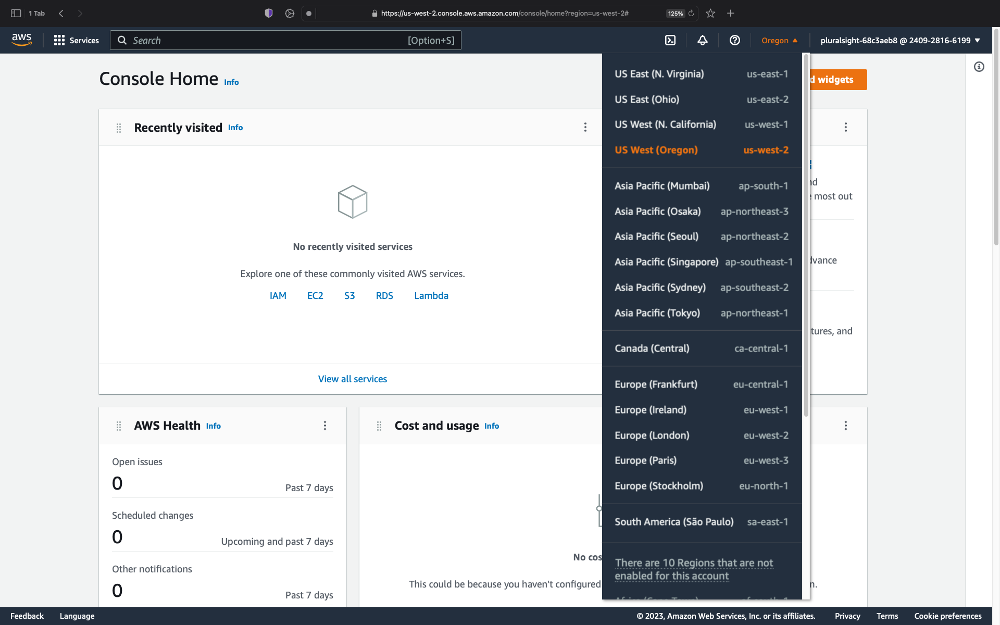

1. Step
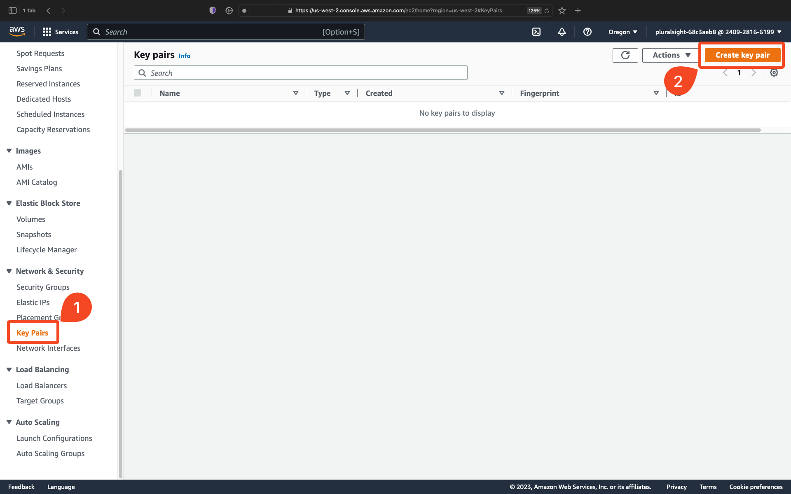

1. Step
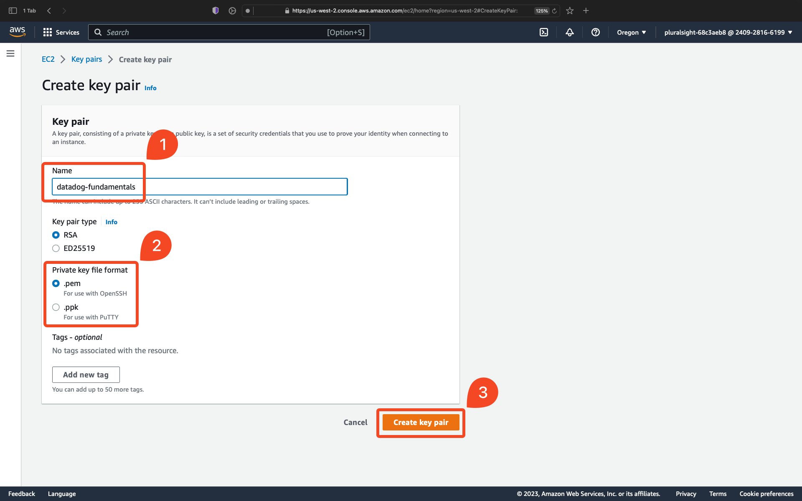

1. Step
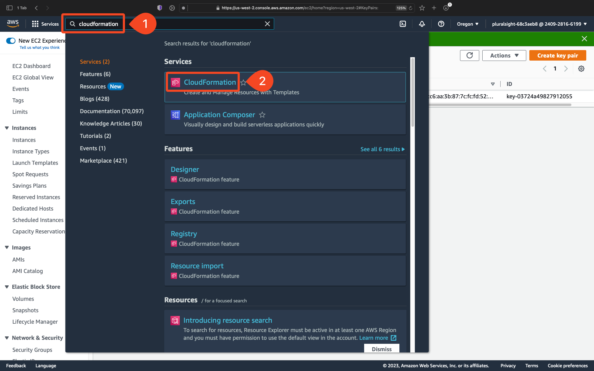

1. Step
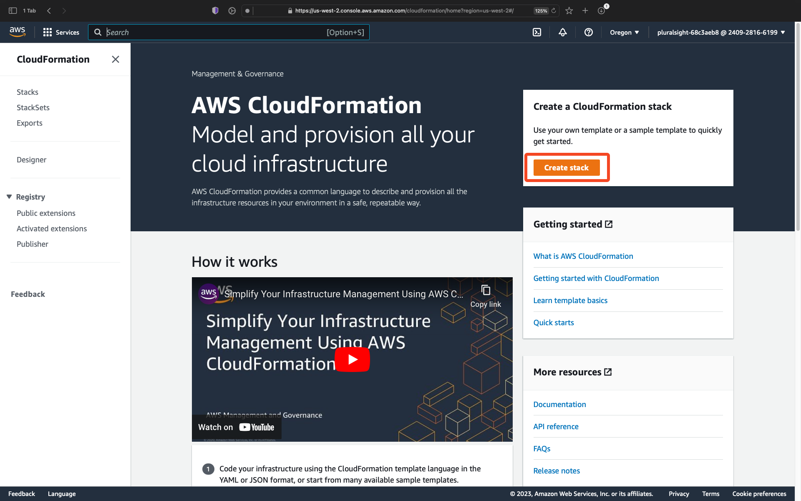

1. Step
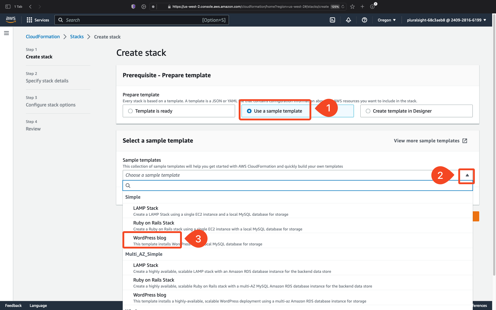

1. Step
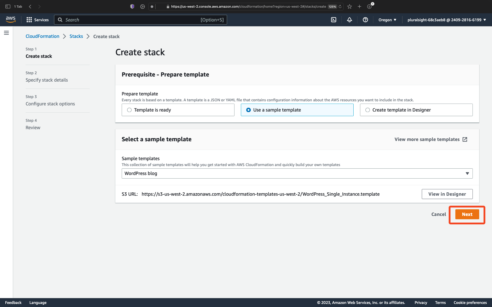

1. Step
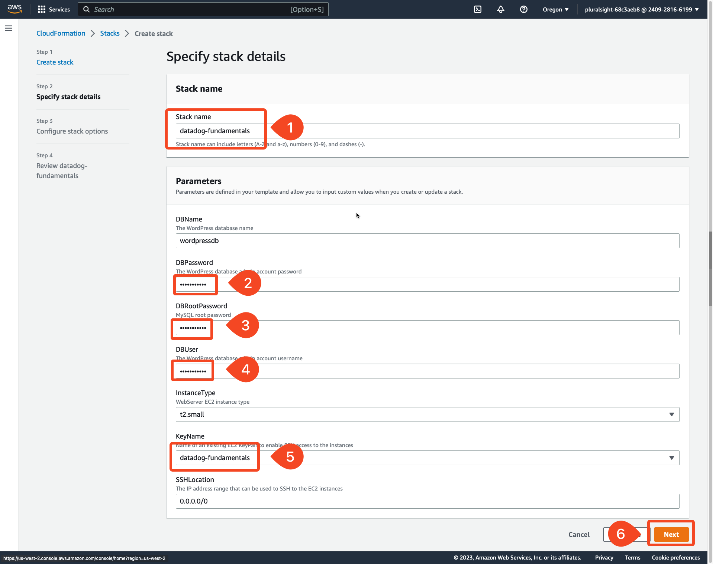

1. Step
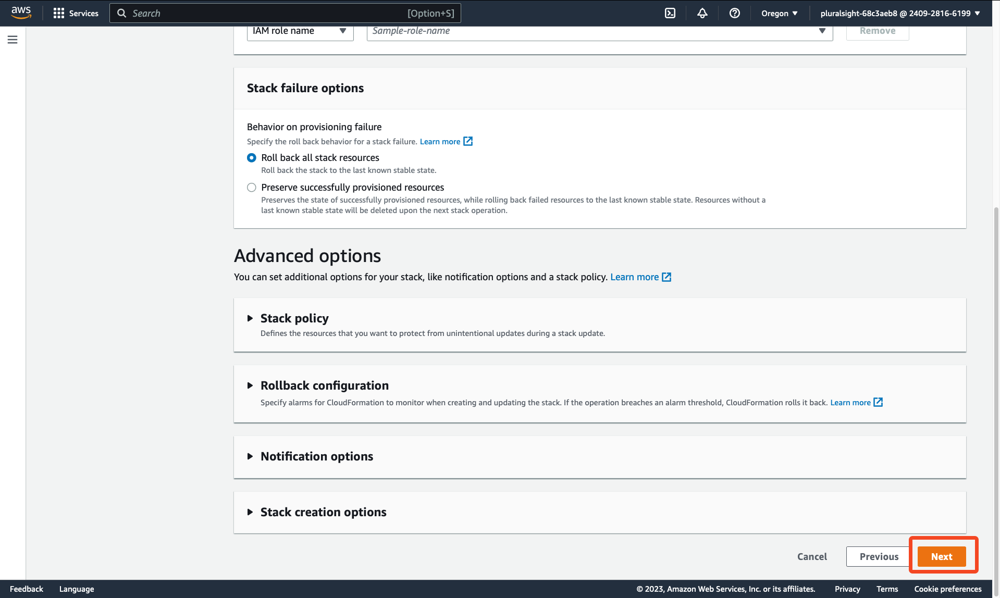

1. Step
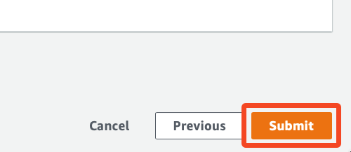

1. Step
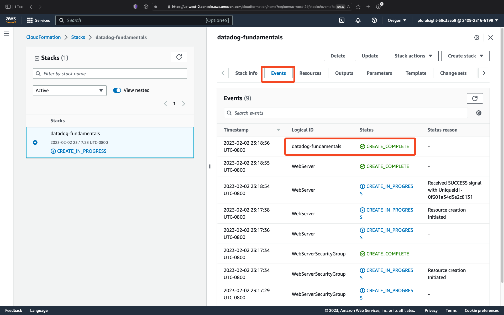

1. Step
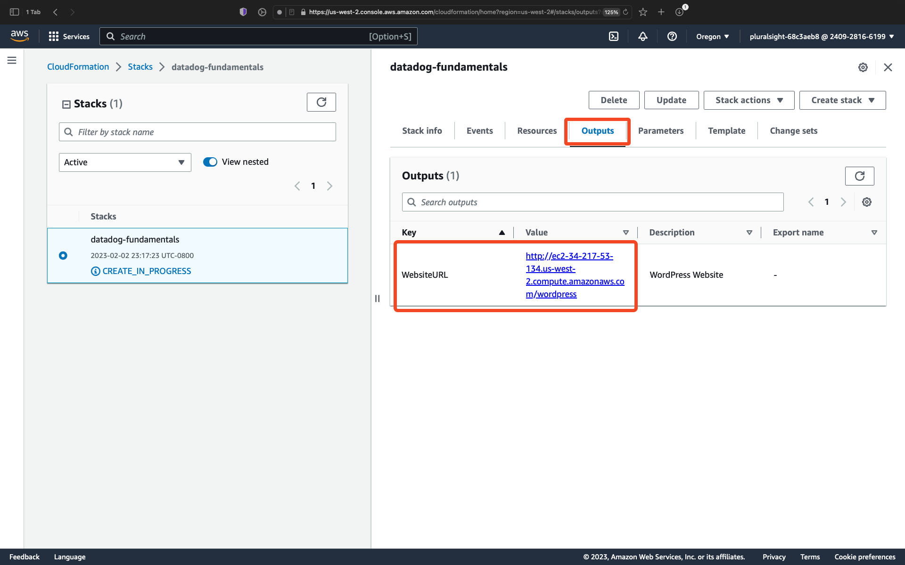

1. Step
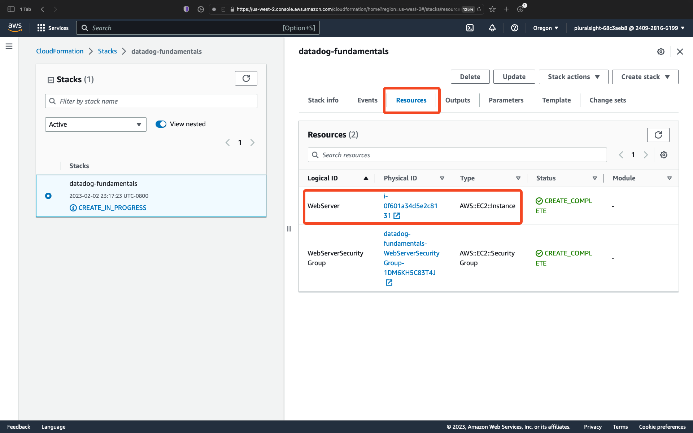

1. Step
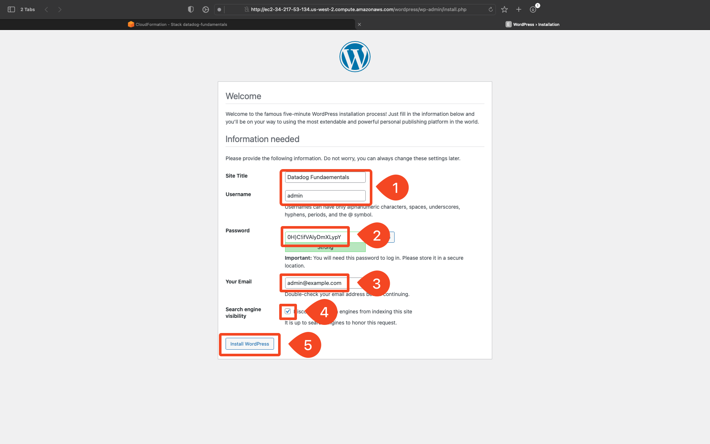

1. Step
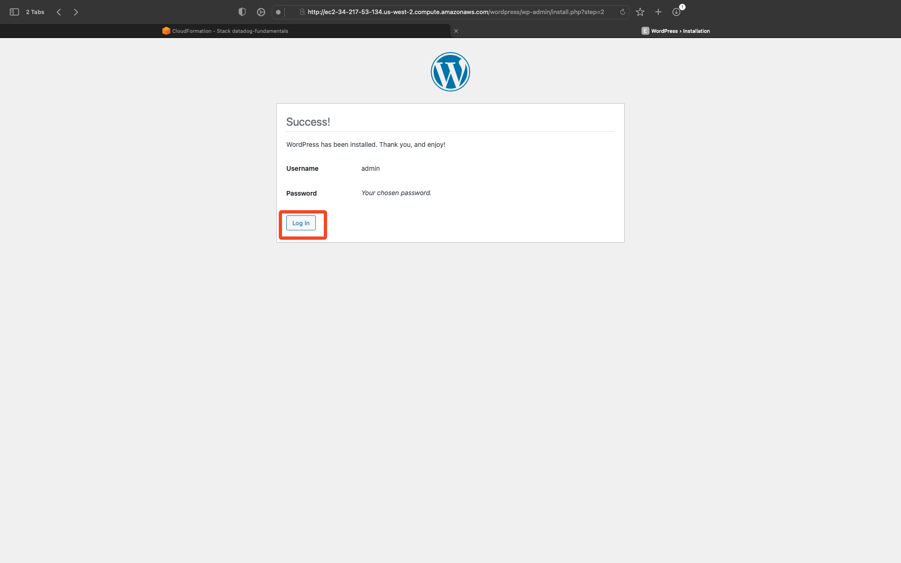

1. Step
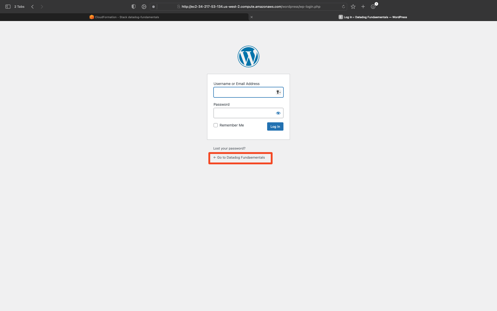

1. Step
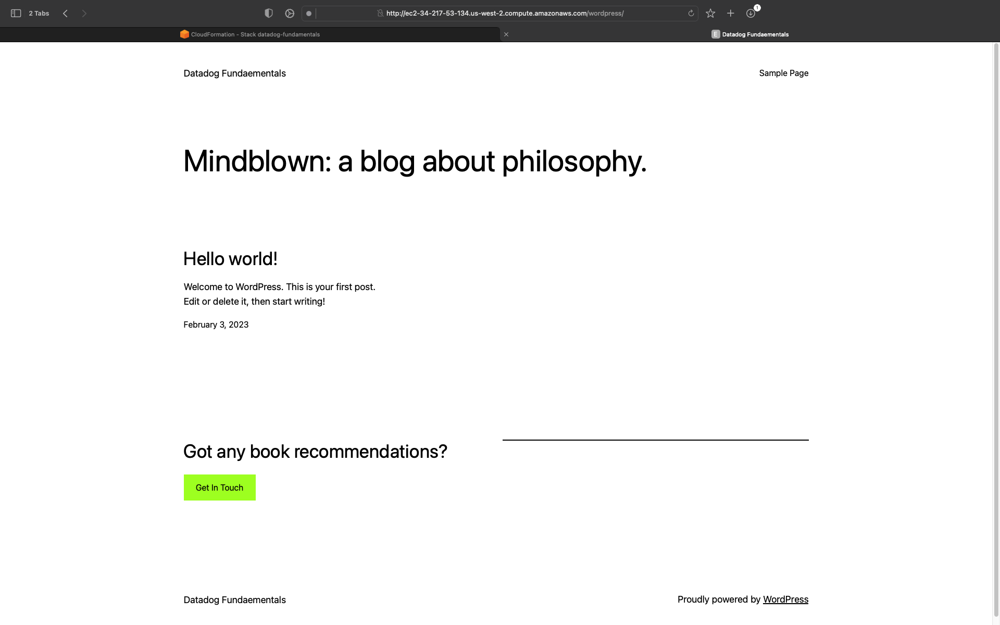