# Deploy a Demo Server Using an AWS CloudFormation Template
To follow along with the Datadog Fundamentals course, you'll need a server.  The server will be used to represent the demo server being used by Globomantics to explore the features of the Datadog service.

The course was developed using a server running in [Amazon Web Services (AWS)](https://aws.amazon.com/) with the following specs:

- Amazon Linux 2
- Apache HTTPD
- PHP-FPM
- WordPress

Fortunately, the [AWS CloudFormation service provides templates](https://aws.amazon.com/cloudformation/resources/templates/) that we can use to deploy a server with these specs.

The following steps will walk you through deploying a demo server using a CloudFormation template.

1. Create an AWS account or use one that is available to you.  Once your account is in place, log in and select the region where your resources will be deployed.  Note that you'll be creating an SSH key and a CloudFormation stack.  Both of these resources need to be in the same region.

    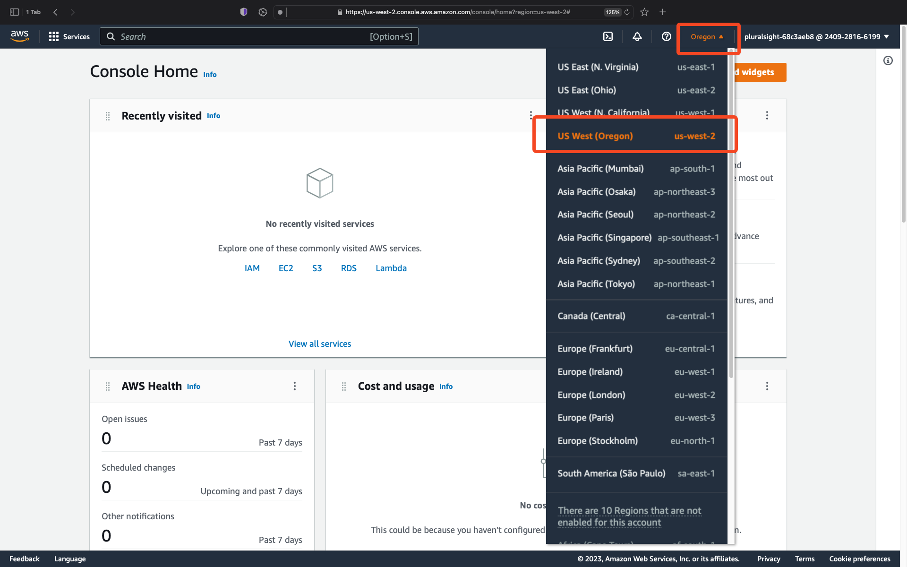

1. Open the EC2 console and select (1) `Key Pairs` under `Network & Security`.  Then (2), select `Create key pair`.

    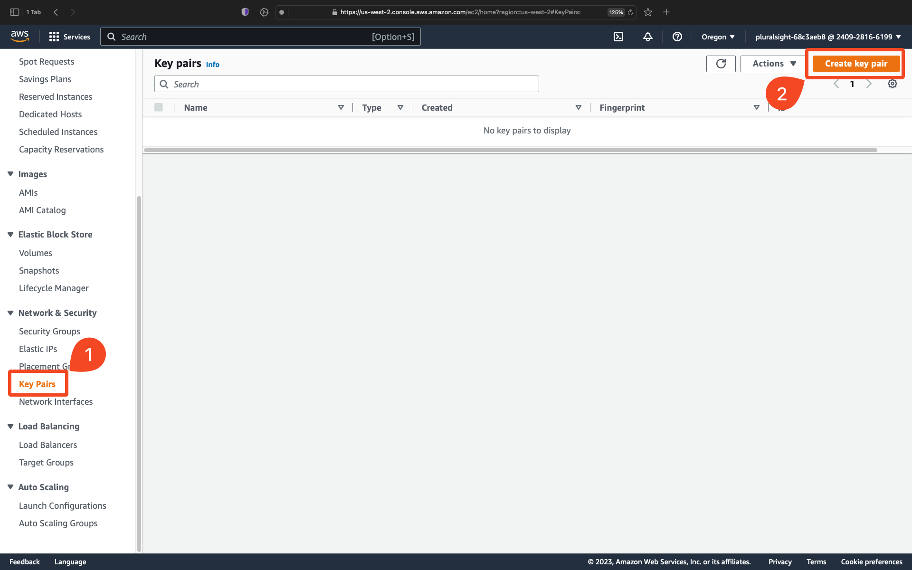

1. On the "Create key pair" dialog, (1) name the key pair; "datadog-fundamentals" is a good choice for this. (2) Select the type of key to generate and (3) select `Create key pair`.  If you are using [Putty to SSH from a Windows system](https://www.putty.org/), you will likely need to create a key using the ".ppk" format.  Otherwise, use the ".pem" format.  Make a note of where the key is saved on your local system as you'll need it to connect via SSH.

    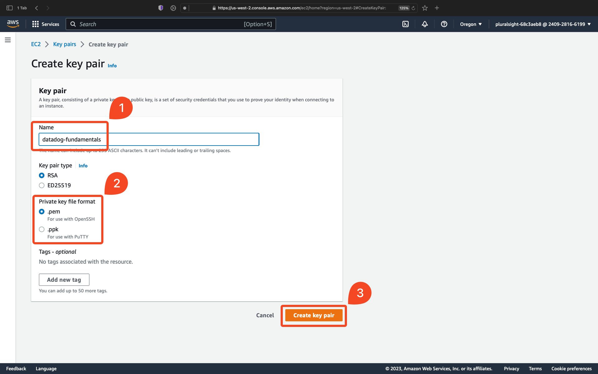

1. In the search bar at the top of the window (1) search for "cloudformation" and (2) select `CloudFormation`.

    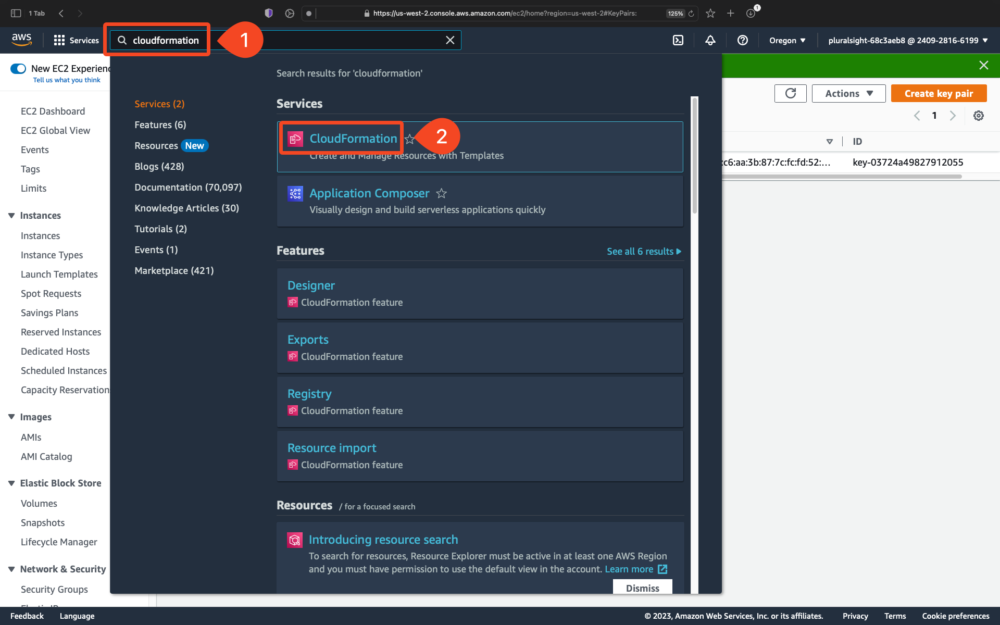

1. On the CloudFormation home page, select `Create stack`.

    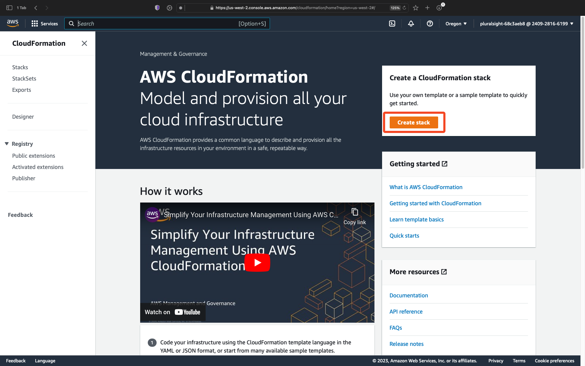

1. On the "Create stack" page, (1) select `Use a sample template`. (2) Open the dropdown to reveal the available templates. (3) select the `WordPress blog` template.

    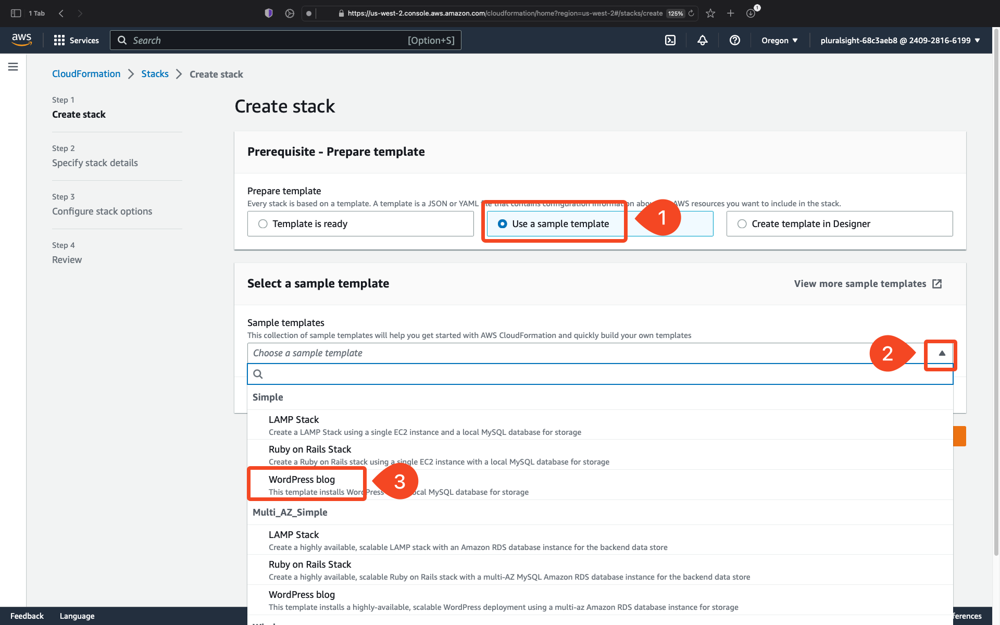

1. With the `WordPress blog` template selected, click `Next`.

    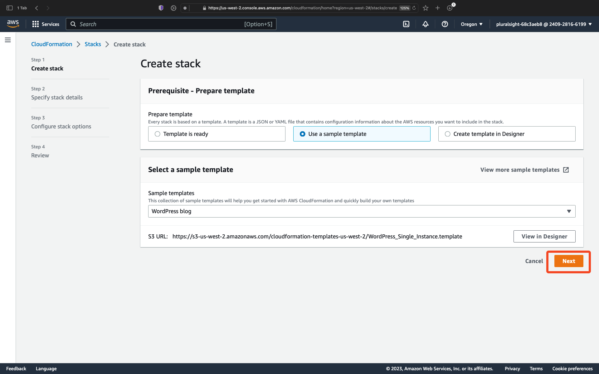

1. On the `Specify stack details` dialog, (1) give the stack a name, "datadog-fundamentals" is a good choice for this. (2) Enter a value for `DBPAssword`, (3) `DBRootPassword`, and (4) `DBUser`.  Make a note of these values so you can recall them later. (5) In the `KeyName` field, enter the name of the key you created in this region. (6) Select `Next`.

    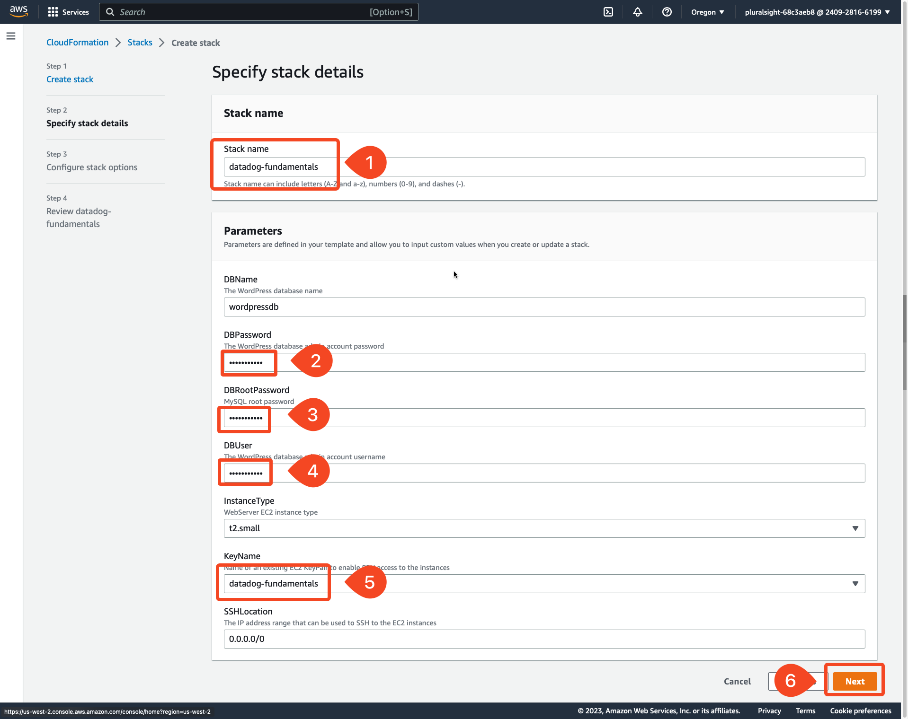

1. On the next screen, select `Next`.

    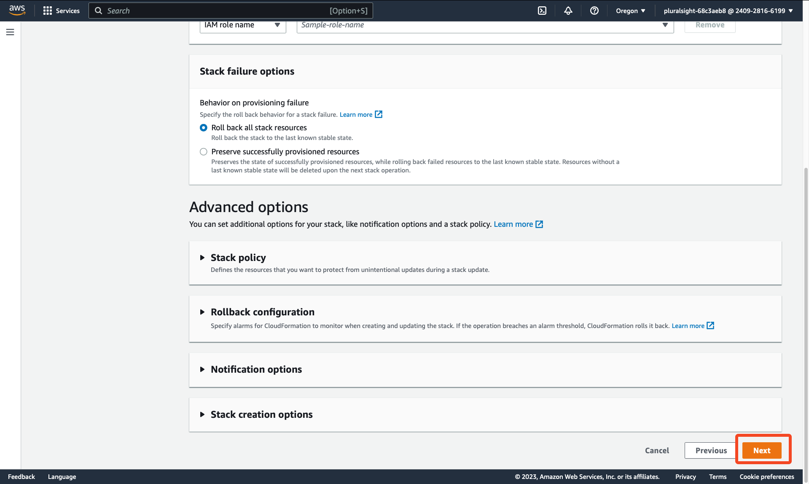

1. And finally, select `Submit`.

    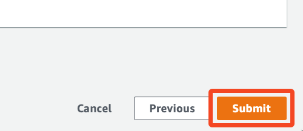

1. Monitor the stack creation process by selecting the stack and then the `Events` tab.  Wait until the `CREATE_COMPLETE` event is reported.

    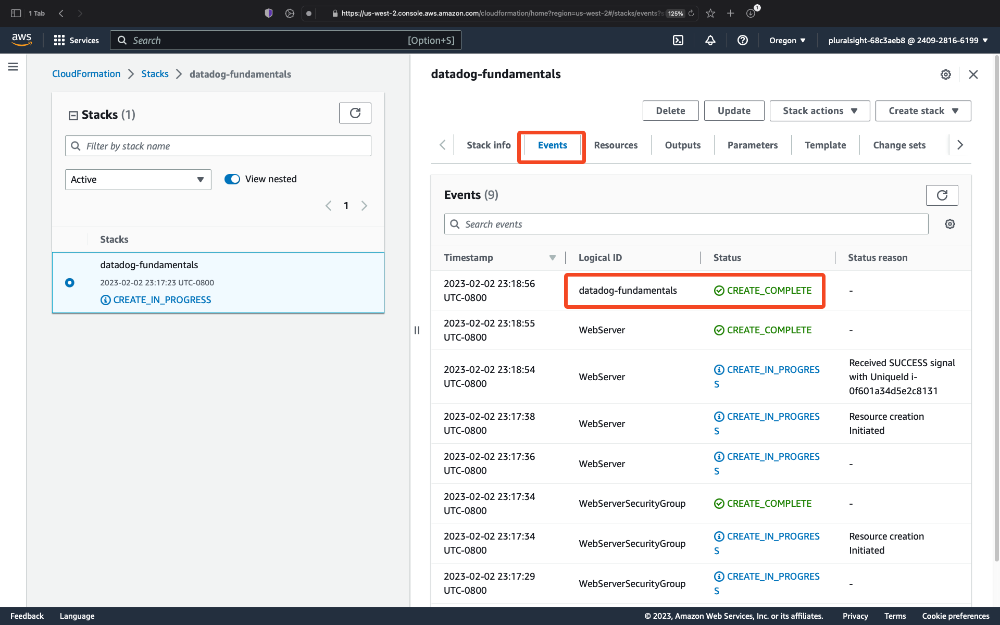

1. Select the `Resources` tab.  Make a note of the value for `WebServer`.  This is the EC2 instance that was deployed as your demo server.  Follow the link under the `Physical ID` column to find more details for the server including the IP address and/or Public DNS Name.  Use the IP address or Public DNS Name to connect to the server using SSH.

    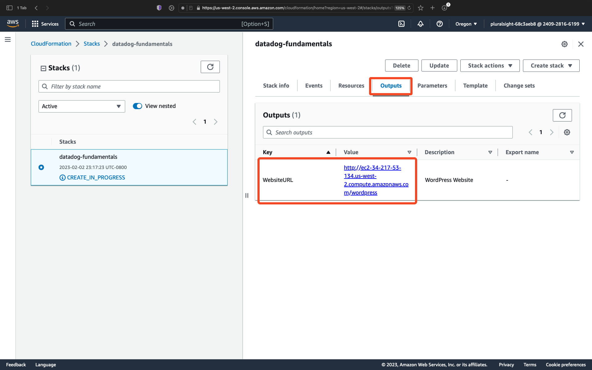

1. Select the `Outputs` tab and note the value for `WebsiteURL`.  This is the HTTP address for your demo server.  Make a note of the address and then open it in a new tab.

    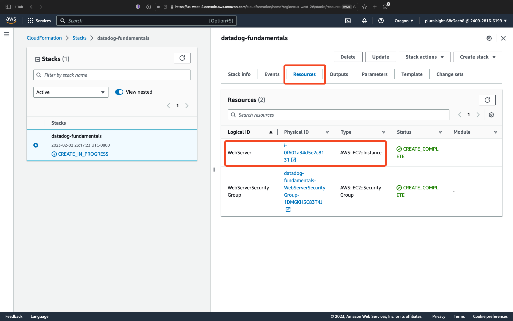

1. On the WordPress installation dialog, (1) enter a `Site Title` and `Username`. (2) Enter a password or keep the generated password if one is provided.  In either case, make a note of the password for future reference. (3) Enter an email address.  It does not have to be a valid email address. (4) Check the box next to `Search engine visibility`. (5) Select `Install WordPress`.

    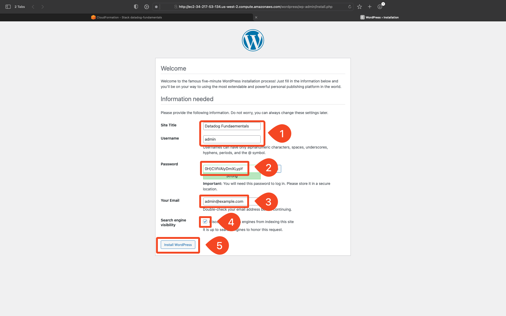

1. After the installation completes, select `Log in`.

    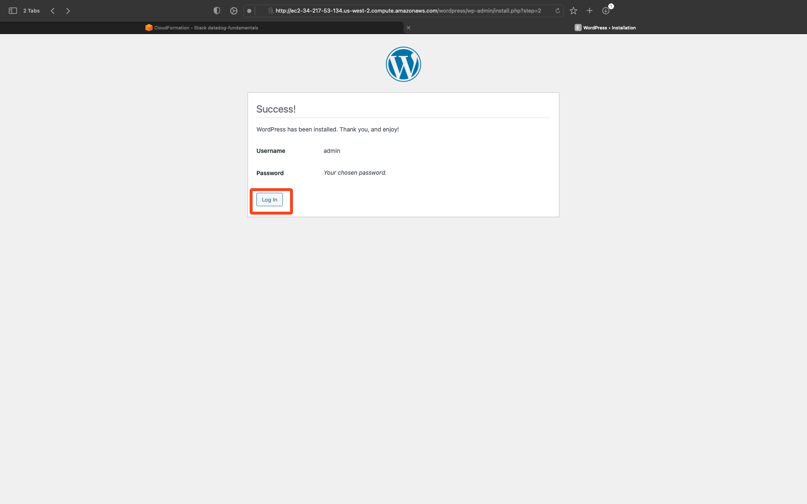

1. Select `Go to Your_Site_Name_Here`.

    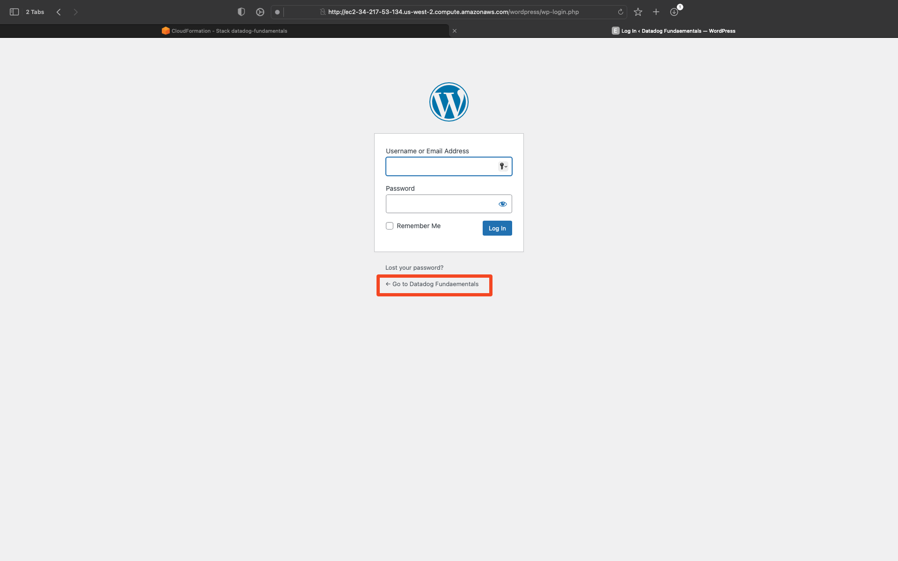

1. If a page similar to the following is displayed, your demo site and demo server are now up and running.

    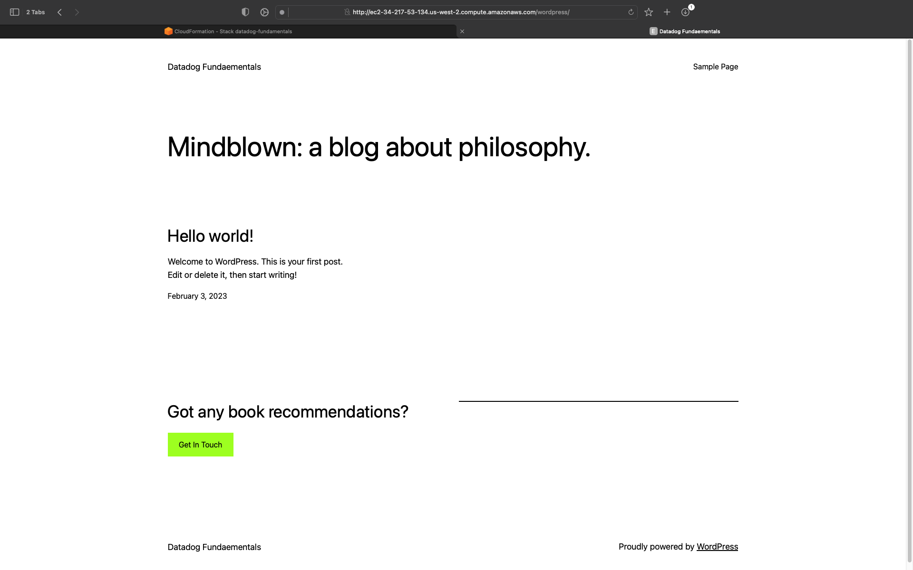