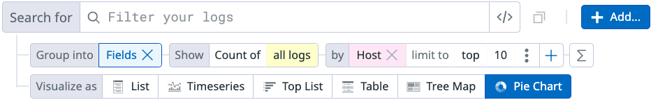

# Explore Logs
In this demo we’ll explore logs in the Datadog web interface.

## References
- [Log Explorer](https://docs.datadoghq.com/logs/explorer/)

- [Search Logs](https://docs.datadoghq.com/logs/explorer/search/)

- [Log Analytics](https://docs.datadoghq.com/logs/explorer/analytics/)

- [Live Tail](https://docs.datadoghq.com/logs/explorer/live_tail/)

## Prerequisites
Be sure that you have already:
1. Set up a demo server
1. Installed the Datadog agent.
1. Configured the agent to report APM data for php-fpm and Apache httpd.
1. Configured the agent to collect logs from Apache.

## Generate Logs
Run the following script on your demo server(s) to generate logs.

```
while :;
do
    wget --spider --recursive --wait=1 localhost/wordpress;
done
```

The `--spider` and `--recursive` parameters cause `wget` to  follow each link in the target URL.  Each request will generate a corresponding log in Apache.

The `while` loop will run the `wget` continuously.


## Add Some Spice to the Logs with Errors
To create some variety in the logs, stop the database service on a demo server.  This will cause server side errors in the application which will be logged as 500 errors by datadog.

Use the following command to stop the database on a server configured using the directions included in this demo.  If you are using a different configuration or database service, adjust the command as needed:

```
sudo systemctl stop mariadb.service
```


## Set the Time Range and Open a Saved View

1. Open the Logs Explorer in the Datadog web interface.
1. Use the time selector to select an appropriate time range for the logs that will be displayed.
1. Select the search field.  Note the options to build a query to filter logs.
1. Note the "saved views" created by the Apache integration.
1. Select the saved view named "Apache 4xx Errors".
1. Observe how the Logs Explorer is updated with a query focused on observing 4xx errors logged by Apache.
1. To return to the default view, select "Views -> My View".


## Use Groups and Visualizations
1. Below the "Search" field and next to "Group into", select "Fields".
1. Update the grouping to display "Group by Fields, Count of all logs by Host"

    

1. Select the visualizations and observe the output:

    - Timeseries
    - Top List
    - Table
    - Tree Map
    - Pie Chart

1. Select "X" next to Fields to close the grouping.
1. Select "Patterns".
1. Observe the visualization for the List view.
1. Select "X" next to Patterns to close the grouping.
1. Select "Transactions".
1. Observe the visualization for the List view.


## View Logs in Real Time with Live Tail
1. Use the time selector to select "Live Tail".
1. Observe the display being updated in real time as logs are collected.
1. Note the message from Datadog indicating the percentage of logs being displayed due to log sampling.
1. Select the search field. Select the saved view named "Apache 5xx Errors".
1. Add a filter for `@http.method:GET`.
1. Observe the changes to the logs displayed and changs in the sampling rate.


## Logs and APM Traces
1. Select "APM" -> "Traces".
1. Update the APM view to only display traces associated with errors for the globomantics service.
1. Select a trace.
1. Select the "Logs" tab on the trace view.
1. Select "Trace ID" and then select "Host".
1. Observe the logs added to the logs view.
